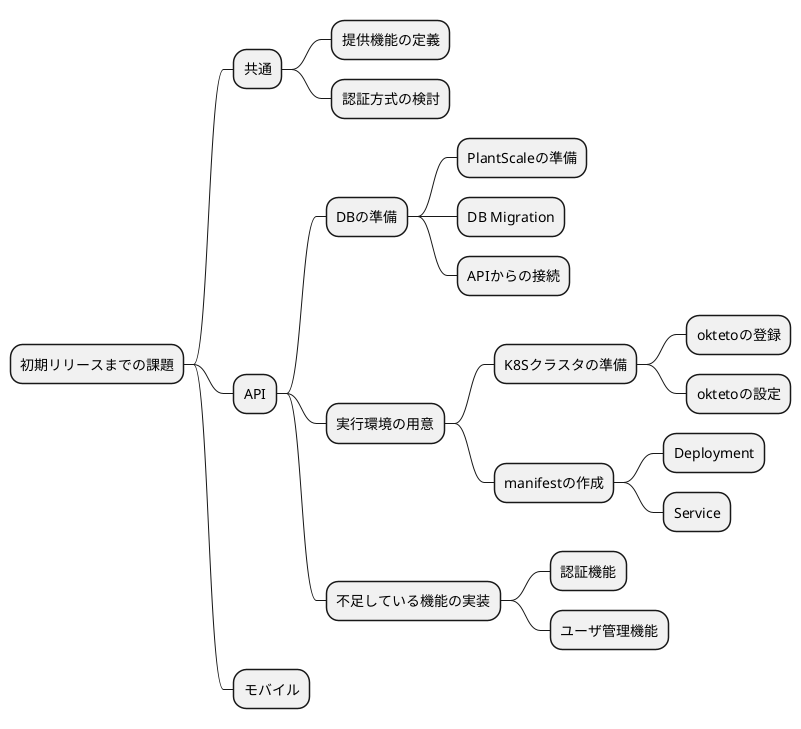

```plantuml
@startmindmap first-release

* 初期リリースまでの課題
** 共通
*** 提供機能の定義
*** 認証方式の検討
** API
*** DBの準備
**** PlantScaleの準備
**** DB Migration
**** APIからの接続
*** 実行環境の用意
**** K8Sクラスタの準備
***** oktetoの登録
***** oktetoの設定
**** manifestの作成
***** Deployment
***** Service
*** 不足している機能の実装
**** 認証機能
**** ユーザ管理機能
** モバイル

@endmindmap
```
