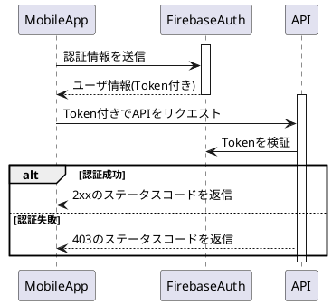

# 認証方式の検討

## 全体の流れ

```plantuml
@startuml

participant MobileApp
participant FirebaseAuth
participant API

activate FirebaseAuth
MobileApp -> FirebaseAuth: 認証情報を送信
return ユーザ情報(Token付き)
deactivate FirebaseAuth

activate API
MobileApp -> API: Token付きでAPIをリクエスト
API -> FirebaseAuth: Tokenを検証
alt 認証成功
API --> MobileApp: 2xxのステータスコードを返信
else 認証失敗
API --> MobileApp: 403のステータスコードを返信
end
deactivate API

@enduml
```
