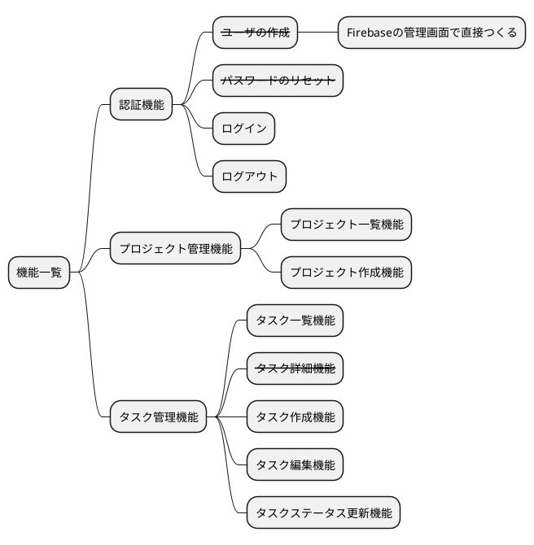

# 初期リリースの提供機能

```plantuml
@startmindmap

* 機能一覧
** 認証機能
*** <s>ユーザの作成</s>
**** Firebaseの管理画面で直接つくる
*** <s>パスワードのリセット</s>
*** ログイン
*** ログアウト
** プロジェクト管理機能
*** プロジェクト一覧機能
*** プロジェクト作成機能
** タスク管理機能
*** タスク一覧機能
*** <s>タスク詳細機能</s>
*** タスク作成機能
*** タスク編集機能
*** タスクステータス更新機能

@endmindmap
```

## 画面デザイン

  
  
  

